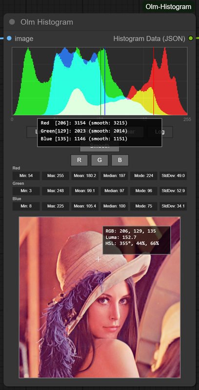

# Olm Histogram for ComfyUI



A compact, real-time histogram analysis node for ComfyUI — with easy-to-use interactive UI, smooth rendering, and accurate pixel sampling. Built for compositing-style workflows and color diagnostics.

- Author: Olli Sorjonen
- GitHub: https://github.com/o-l-l-i
- X: https://x.com/Olmirad
- Version: 1.0.1.1 (Chain original mouse event handlers to maintain subgraph header button functionality in ComfyUI frontend 1.24.4 and later.)

---

## 📊 What Is This?

Olm Histogram is a standalone visualization tool for inspecting the color or luminance distribution of an image within ComfyUI. It provides a clean task-focused UI with a polished frontend, real-time feedback, and live pixel sampling.

The node is inspired by practical grading tools used in post-production (like DaVinci Resolve, Nuke, or Photoshop), with emphasis on clarity and responsiveness.

---

## Features

- Histogram Visualization
  - Supports luminance or RGB channel modes
  - Toggleable channel visibility for focused inspection
  - Smoothed data display

- Pixel Hover Sampling
  - Hovering over the preview shows color and stats for individual pixels
  - Histogram bin highlighting corresponds to hovered pixel’s value

- Linear / Logarithmic Scale Toggle
  - Useful for revealing detail in dark or bright ranges

- Live Thumbnail Preview
  - Run the graph once to get a preview from upstream
  - Scales with node size
  - Responds to image aspect ratio — portrait or landscape

- Polished Layout
  - Responsive UI, scales and keeps elements nicely placed
  - Prevents image overflow etc. prototypish things :)

- JSON output
  - Get data for downstream use in JSON format.

---

## Modes & Toggles

- Luminance — Combined grayscale brightness using perceptual weights
- RGB — Overlayed or separated Red, Green, Blue histograms
- Smooth mode toggle

Channel toggles (R/G/B) appear when in RGB mode.
Smooth toggle applies histogram smoothing for a softer visual curve.

---

## Installation

Clone into your custom_nodes directory:

```bash
git clone https://github.com/o-l-l-i/ComfyUI-Olm-Histogram.git
```

Structure should look like:

```bash
ComfyUI/
└── custom_nodes/
    └── ComfyUI-Olm-Histogram/
        ├── __init__.py
        ├── olm_histogram.py
        └── ...
```

Restart ComfyUI after installing.

✅ No extra Python dependencies required.

---

## 🧪 How to Use

1. Add the Olm Histogram node to your graph
2. Connect any image output (from Load Image, a sampler, etc.)
3. Connect an output (required for execution)
4. Run the graph once
5. Hover over the histogram to inspect bins
6. Hover over the preview to inspect color values and see bin highlighting
7. Use the buttons to:
 - Toggle between Luminance / RGB
 - Switch scale type
 - Show/hide RGB channels individually
 - Enable smoothing

---

## 🎯 Tips

- Works well as a debugging node inline in your workflow
- Add this node downstream from effects or adjustments to compare before/after histograms, works great with an image comparison node like Rgthree's or Eses'
- Logarithmic scale is especially useful for inspecting shadows
- Smoothing can help read overall shape, especially with high-frequency images

---

## Known Limitations
- Preview only appears after graph has been run at least once (technical ComfyUI/LiteGraph limitation)
- The hover info shown over the preview reflects the lower-resolution preview image, not the full-size original.
- No support for masking or region-based histograms (yet)
- No histogram overlay on output image

---

## Version History

- **1.0.1.1** Chain original mouse event handlers to maintain subgraph header button functionality in ComfyUI frontend 1.24.4 and later.
- **1.0.0** Initial release

---

## License & Usage Terms

Copyright (c) 2025 Olli Sorjonen

This project is source-available, but not open-source under a standard open-source license, and not freeware.
You may use and experiment with it freely, and any results you create with it are yours to use however you like.

However:

Redistribution, resale, rebranding, or claiming authorship of this code or extension is strictly prohibited without explicit written permission.

Use at your own risk. No warranties or guarantees are provided.

The only official repository for this project is: 👉 https://github.com/o-l-l-i/ComfyUI-Olm-Histogram

---

## Author

Created by [@o-l-l-i](https://github.com/o-l-l-i)